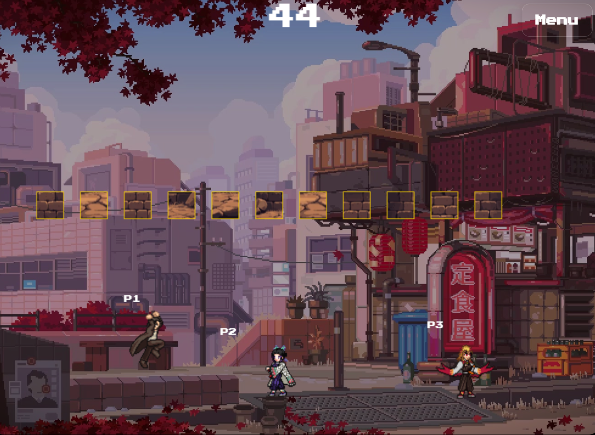
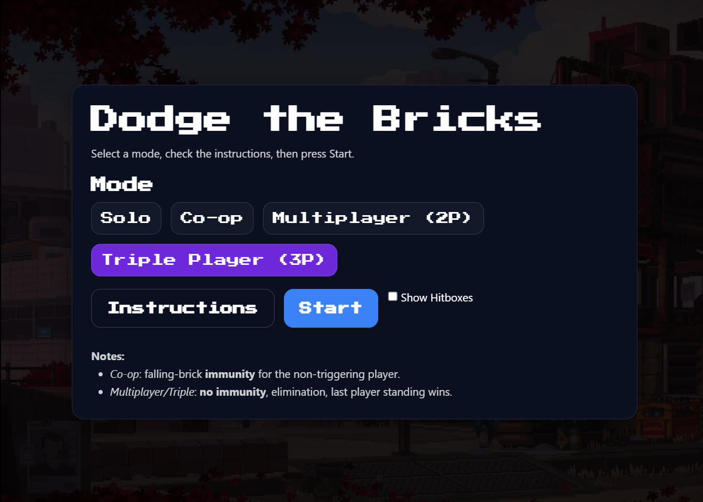
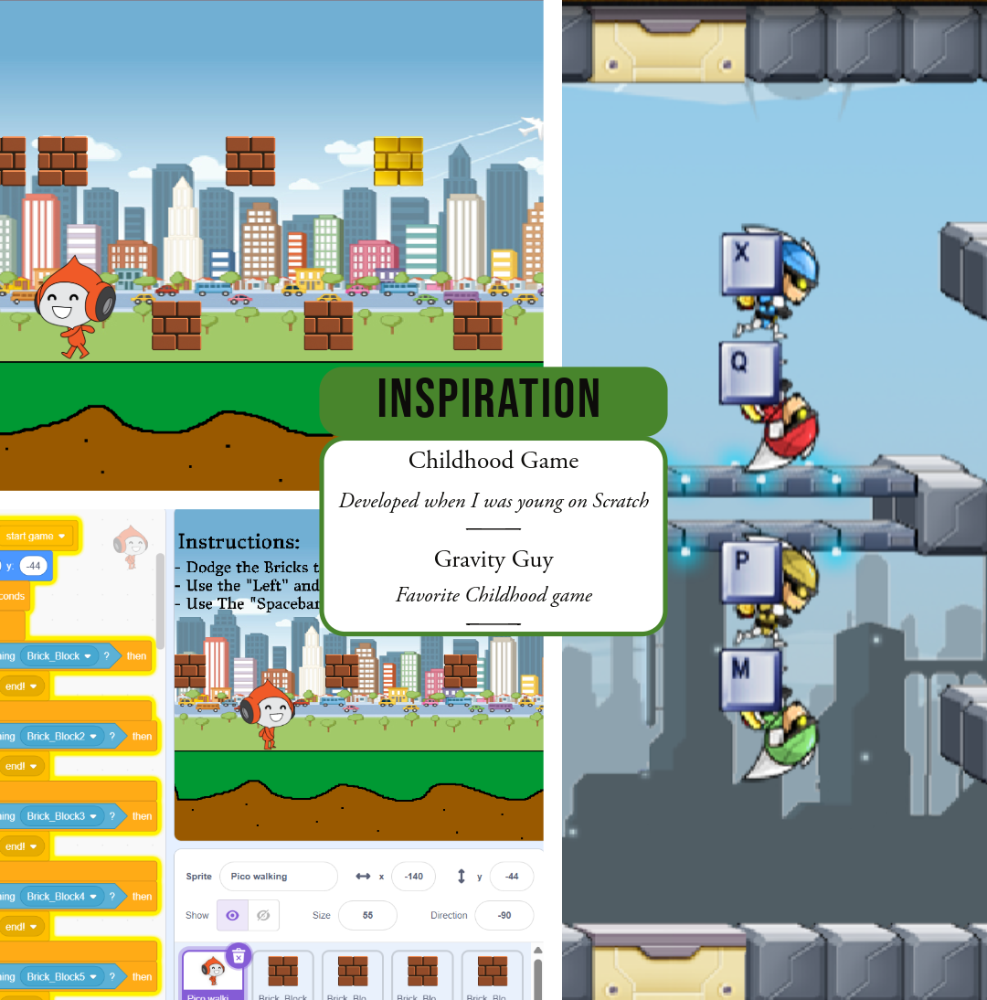
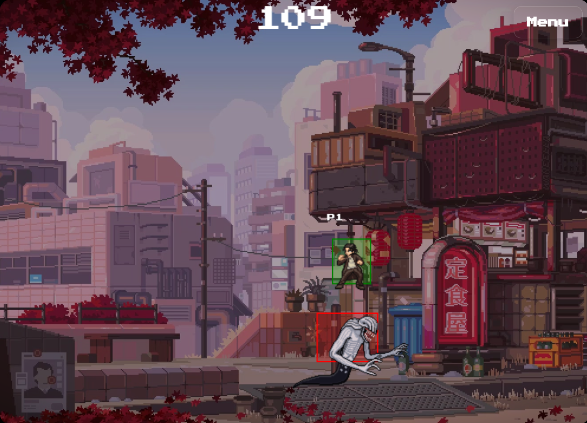
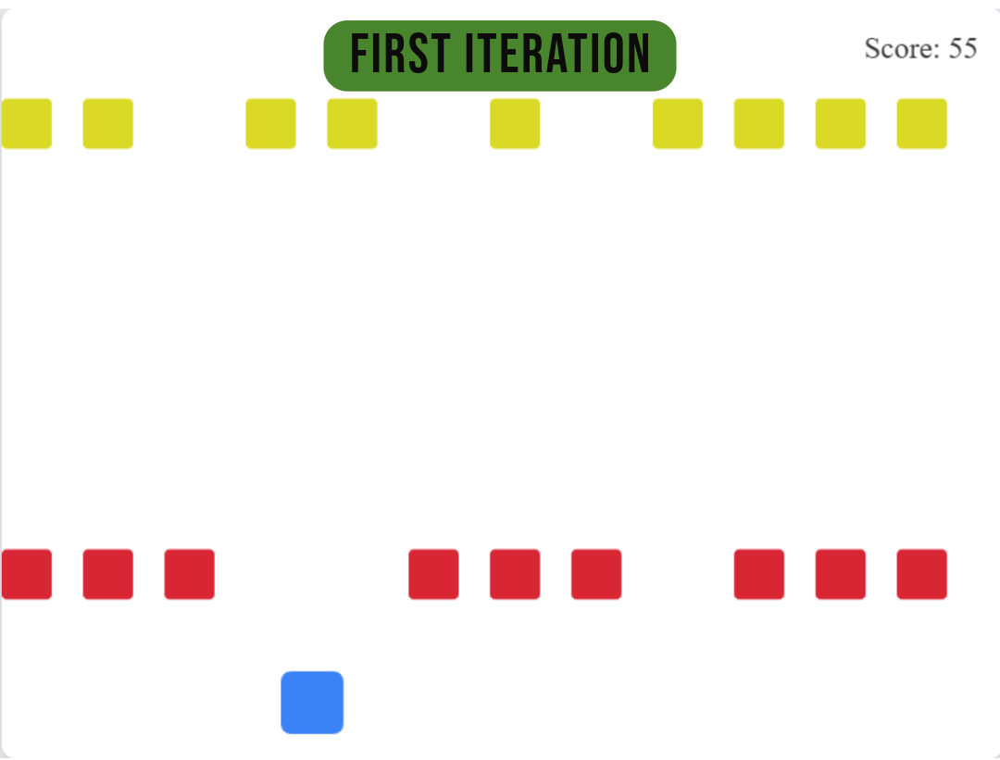

# 🧱 Dodge the Bricks



**Dodge the Bricks** is a fast-paced retro-style survival game built with **HTML, CSS, JavaScript (Canvas API), and TailwindCSS**.  
Players must dodge falling and flying bricks while competing or cooperating across different modes. The last player standing wins in competitive play!

---

## 🎮 Game Modes

- **Solo** → Play alone and survive as long as possible.  
- **Co-op** → Two players team up. When a brick is triggered, only the triggering player is vulnerable — the partner has temporary immunity.  
- **Multiplayer (2P)** → Two-player competitive mode. No immunity — last player standing wins.  
- **Triple Player (3P)** → Three-player battle royale mode. No immunity — every brick counts.

---

## 🕹️ Controls

### Player 1  
- `W` → Jump  
- `S` → Duck  
- `A` → Move Left  
- `D` → Move Right  

### Player 2  
- `↑` → Jump  
- `↓` → Duck  
- `←` → Move Left  
- `→` → Move Right  

### Player 3  
- `I` → Jump  
- `K` → Duck  
- `J` → Move Left  
- `L` → Move Right  

---

## 📸 Screenshots

  
  
  
  
  

---

## ⚡ Features

- Retro **pixel-art inspired** style using [Press Start 2P font](https://fonts.google.com/specimen/Press+Start+2P)  
- Dynamic **falling and horizontal brick mechanics**  
- **Multiple characters** with sprite animations  
- **Pause & Resume system**  
- **Game Over screen** with results  

---

## 🚀 Getting Started

1. Clone the repository:
   ```bash
   git clone https://github.com/yourusername/dodge-the-bricks.git
